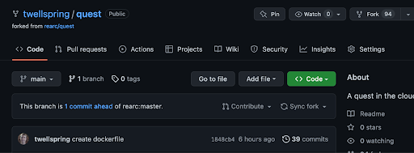
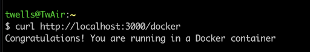
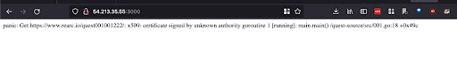
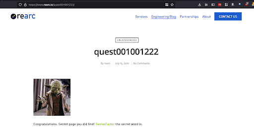
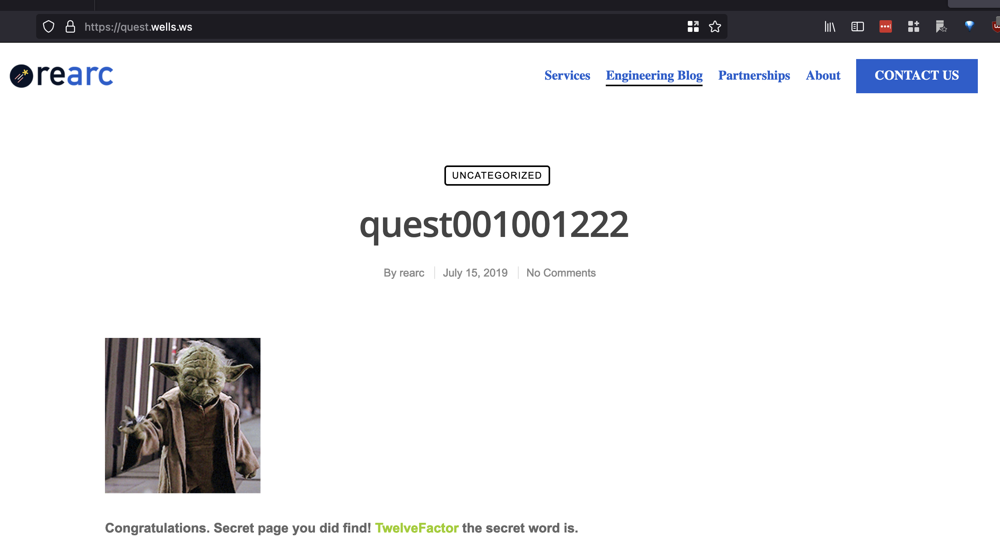
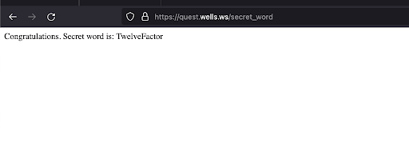
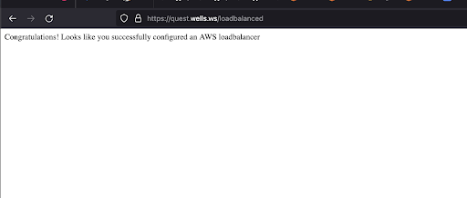

# Rearc Quest for Todd Wells

## Introduction
This README, the code in this repo and the instantiation of this code in AWS at the URL [https://quest.wells.ws](https://quest.wells.ws) are my answer to the Rearc Quest. The following narrative describes the steps taken, or not taken, and has screenshots of the intermediate steps not readily visible in the finished product.

## #1 Create Git Repo:
I chose to use fork the existing repo. 

## #2 Deploy to public cloud
While a simple demonstration application like this can be deployed directly on a virtual server, very few thoughtfully designed cloud based applications will be deployed this way. So for this exercise I chose to skip this deployment methodology.

## #3 Deploy the app in a Docker container
I used a Dockerfile to compile the quest application, then ran it locally and accessed it via curl to validate this docker application. 

I then deployed it via terraform to ECS (Manual creation of resources followed by "codifying" for me has been an anti-pattern.) Terraform deploys all resources except for: 
- the docker image, created and deployed to ECR via the `make all` command 
- DNS entry, manually created on my hosting provider
- TLS Certs, downloaded from my hosting provider

While troubleshooting a vague ECS error in  my deployment I realized the image I had uploaded was ARM instead of x86. I chose to update the Makefile to create an X86 image. After this was "fixed" I also ran into the following error on the root URL.

I chose to move forward instead of another troubleshooting session and used the URL on the error page to access the Secret word. 

When I did go back later, the issue was the `node:slim` image I was using did not have the appropriate root certificates. Switching to `node:latest` resolved the issue and gave me the secret word page directly.

## #4 Inject the Secret Word
At first I just passed in my own secret word. But after resolving the issue above, I went back and passed in the real secret word, though this was after enabling the load balancer as is visible in the screenshot.

## #5 and #7 Deploy Load Balancer, with TLS
I Chose to add the load balancer in front of the ECS and enable HTTPS at the same time. Once that worked, I moved the ECS service into the private subnets.

# Given more time, I would improve

This exercise is similar to a Proof of Concept where the focus is on quickly proving that something works, followed by a full implementation that makes the solution production ready.  It has similar shortcomings. 

Due to lack of time there are a few things that I did not include that would "complete" this basic application
- A Github Action or equivalent CICD pipeline to fully automate the solution
- Separate infrastructure and application deployments. A "full stack" terraform state is usually cumbersome and difficult to manage.
- Multiple deployment environments (dev, qa/staging, prod)
- Semantic versioning
- Logging and monitoring

From a security perspective, there are several baseline improvements that should be made. As above these are left out due to lack of time.  
- The security groups were overly broad and should be restricted.
- A secure storage mechanism for the TLS credentials (and the "Secret Word") is needed.
- Code scanning and image scanning should be added
- Restrict access to the repo and enforce pull requests and approvals.

The quest did not include any compliance requirements (HIPPA, FedRAMP, PCI). If any are relevant, the basic solution architecture would likely need to be re-evaluated. Similarly no information about load was included.  ECS might be a reasonable solution for a low to moderately used system, but at higher loads it will probably not be sufficient both from a performance and cost perspective.
