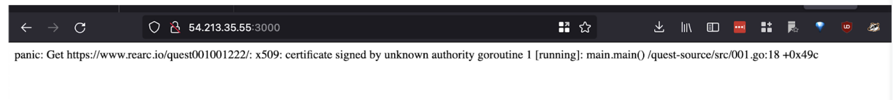

# Rearc Quest Evidence for Todd Wells

This page contains all of the evidence requested and the following narrative and `What would I improve` answer.
- Repo [https://github.com/twellspring/quest](https://github.com/twellspring/quest)
- Running code [https://quest.wells.ws](https://quest.wells.ws)

## #1 Create Git Repo:
I chose to fork the existing repo 

## #2 Deploy to public cloud
Cloud native applications are usually not deployed directly to a virtual server. So for this exercise I chose to skip that deployment.

## #3 Deploy the app in a Docker container
I created a local docker container and accessed it via curl, then deployed it via terraform to ECS. (Sometimes I will manually create resources when experimenting with a new service, but for most work I choose to go directly to terraform.)

After deploying to ECS and going to the root url I get an error. This appears to be an issue with the x509 package not having the Amazon root CA. Manually accessing the URL that failed gives me the secret word. I later changed the docker image from `node:slim` to `node:latest` and the root page started working.

## #4 Inject the Secret Word
At first I just passed in my own secret word. But after completing steps 5 & 7, I went back and passed in the real secret word.

[Secret]( images/quest-secretword.png "Secret Word")

## #5 and #7 Deploy Load Balancer, with TLS
I started by adding the load balancer in front of the ECS with TLS right from the start. Once that worked, I moved the ECS service into the private subnets.

## Given more time, I would improve

While there are lots of things that would be important to improve for production, the things that I would improve for this quest if I had the time would be
- A github action run the docker build/publish and then do the terraform deploy. That would remove the need for the local docker build (and in my case save the headache of troubleshooting vague ECS errors to discover the problem was an incompatible image due to my personal Mac Air having an M1 chip).
- I would like to have tried to deploy it to GCE and to write terraform for GCE.
- Separate Infrastructure and Application Terraform. The full stack in a single terraform state brings difficulty either because it gets large and cumbersome or it makes it harder to delete/recreate parts of the stack. For this quest, I would have moved the VPC into its own state and kept the ECS and Load balancer together.
- Use a remote state instead of local state. 
